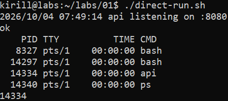
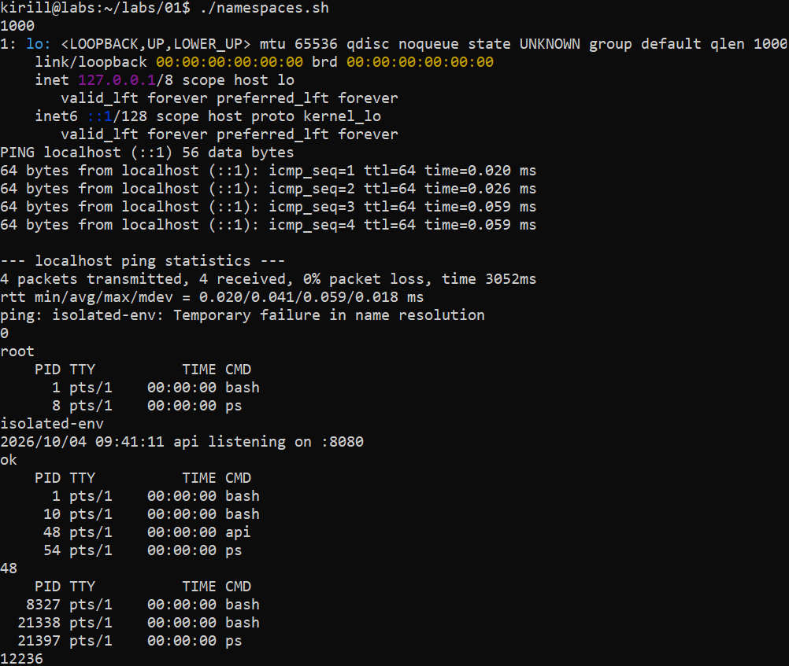

# Лаба 1. ~~Вскрываем~~ Изучаем Docker

## Оглавление

0. [Создаём тестовый сервис](#создаём-тестовый-сервис)
1. [Запускаемся напрямую](#запускаемся-напрямую)
2. [Изолируем через namespaces](#изолируем-через-namespaces)
3. [Ограничиваем ресурсы через cgroups](#ограничиваем-ресурсы-через-cgroups)
4. [Ограничиваем права через capabilities и профиль seccomp](#ограничиваем-права-через-capabilities-и-профиль-seccomps)
5. [Собираем свой Docker из того, что есть у каждого под рукой](#собираем-свой-docker-из-того-что-есть-у-каждого-под-рукой)
6. [Образы, multistage и тома Docker](#образы-multistage-и-тома-docker)
7. [gVisor и чем он хорош](#gvisor-и-чем-он-хорош)
8. [Наблюдаем за подопытным](#наблюдаем-за-подопытным)

## Предисловие

Лаба будет выполняться на виртуальной машине с Debian 13. Сервис будет собираться на Go 1.27.1.

Все скрипты исполняются относительно корня папки с лабой.

## Создаём тестовый сервис

Используя LLM сгенерируем сервис по требованиям на языке программирования Go. Исходный код сервиса представлен в [src/api/main.go](src/api/main.go). 

## Запускаемся напрямую

Напишем скрипт на bash, который соберёт и запустит сервис напрямую, отдаст ответ от health endpoint'а и покажет выводы ps и pgrep. Исходный код скрипта представлен в [src/scripts/direct-run.sh](src/scripts/direct-run.sh). Получим выводы от скрипта, представленные на скрине. Как видно, сервис успешно запустился без изоляции, мы смогли получить его PID и успешно "убить" его по нему.

## Изолируем через namespaces

Добавим рамок нашему сервису через изоляцию с использованием namespaces. Для этого используем команду `unshare` с параметрами `--user --map-root-user --pid --mount --net --uts --ipc --fork --mount-proc`. 

Отметим, за что отвечает каждый namespace:
- user - изолируем пользователей, их группы и capabilities сервиса;
- mount - изолируем список точек монтирования сервиса;
- net - изолируем сетевой стек сервиса (сетевые адаптеры, таблица маршрутизации, правила брандмауэра и прочие части стека);
- uts - изолируем имя хоста и доменное имя сервиса;
- ipc - изолируем межпроцессные взаимодействия (очереди сообщений, семафоры и shared memory) сервиса;
- pid - изолируем пространство идентификаторов процессов сервиса.

Также используются служебные флаги команды `--map-root-user` для отображения текущего локального пользователя в UID 0 окружения сервиса, `--fork` для системного вызова fork(), который создаст процесс с PID 0 в окружении сервиса и `--mount-proc` для создания новой procfs в окружении сервиса.

Для тестирования работы unshare напишем скрипт на bash, который выведет UID текущего пользователя, настроит окружение и запустит в нём тестовый скрипт, который включит loopback интерфейс окружения, проверит его с помощью ping, сменит hostname, выведет имя пользователя окружения и его UID, ps и hostname, а затем запустит [src/scripts/direct-run.sh](src/scripts/direct-run.sh). Исходный код скрипта представлен в [src/scripts/namespaces.sh](src/scripts/namespaces.sh), исходный код тестового скрипта представлен в [src/scripts/test-namespaces.sh](src/scripts/test-namespaces.sh). Получим выводы от скрипта, представленные на скрине. Как видно, наше окружение, изолированное только namespaces успешно работает. 

Но сейчас мы не изолированы от правки файлов в ФС хоста от запускающего пользователя, не ограничены по ресурсам, а также не ограничены в системных вызовах и capabilities.

## Ограничиваем ресурсы через cgroups

Прежде чем начинать работать с cgroups необходимо создать user cgroup subtree, в котором будем создавать cgroups наших процессов. Это также пригодится в части [Собираем свой Docker из того, что есть у каждого под рукой](#собираем-свой-docker-из-того-что-есть-у-каждого-под-рукой).

## Ограничиваем права через capabilities и профиль seccomp

## Собираем свой Docker из того, что есть у каждого под рукой

## Образы, multistage и тома Docker

## gVisor и чем он хорош

## Наблюдаем за подопытным

